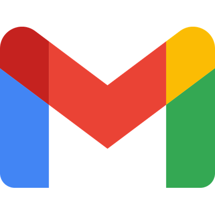

  

  <picture>
    <source media="(prefers-color-scheme: dark)" srcset="https://readme-typing-svg.demolab.com?font=JetBrains+Mono&weight=600&size=21&pause=1200&center=true&vCenter=true&width=560&color=2DD4BF&lines=STM32+%26+ESP32+Firmware;Edge+AI+on+Microcontrollers;IoT+%26+Cloud-Free+Systems;TinyML+Enthusiast" />
    
  </picture>

  <a href="https://www.linkedin.com/in/mohammad-soroush-rabiei-0138a6368/">&nbsp;</a>&nbsp;&nbsp;
  <a href="mailto:mohammadsoroushrabiei@gmail.com">&nbsp;</a>&nbsp;&nbsp;
  <a href="https://t.me/MSoroushRabiei">&nbsp;</a>&nbsp;&nbsp;
  <a href="https://ble.ir/msoroushrabiei">&nbsp;</a>

  &nbsp;&nbsp;
  

## 👨‍💻 About me

- 🎓 B.Sc. in Computer Engineering (Intelligent Systems) — **Isfahan University of Technology**
- 🌱 Exploring **TinyML / on-device learning** and IoT architecture — bringing intelligence to where the data is born
- ⚡ B.Sc. capstone: a smart home running **face recognition and behavior learning entirely on the MCU** — cloud-free by design

## 🚀 Featured projects

<table>
  <tr>
    <th width="215">Project</th>
    <th>What it is</th>
  </tr>
  <tr>
    <td><a href="https://github.com/MohammadSoroushRabiei/Smart-Home">🏠 <b>Smart-Home</b></a></td>
    <td>Self-hosted smart home: on-device face recognition, on-chip self-learning agent, fully local MQTT / Home Assistant stack &nbsp;&nbsp;</td>
  </tr>
  <tr>
    <td><a href="https://github.com/MohammadSoroushRabiei/STM32-DHT22-Driver">🌡️ <b>STM32-DHT22-Driver</b></a></td>
    <td>Non-blocking DHT22/AM2302 driver — Timer Input Capture + DMA, multi-sensor state machine (F407 / F767) &nbsp;</td>
  </tr>
  <tr>
    <td><a href="https://github.com/MohammadSoroushRabiei/STM32-Modbus-RTU">🔌 <b>STM32-Modbus-RTU</b></a></td>
    <td>Non-blocking Modbus RTU master over RS-485 — IDLE-line framing, CRC16, error recovery &nbsp;</td>
  </tr>
  <tr>
    <td><a href="https://github.com/MohammadSoroushRabiei/IoT_SmartRoom_ESP8266">📡 <b>IoT Smart Room</b></a></td>
    <td>ESP8266 + Blynk remote room control & monitoring — IoT course project &nbsp;</td>
  </tr>
</table>

## 🛠️ Tech Stack

  

**Embedded & RTOS** —      

**Protocols & data** —     

**Toolchain** —     

## 📊 GitHub Stats

  <picture>
    <source media="(prefers-color-scheme: dark)" srcset="https://github-readme-stats.vercel.app/api?username=MohammadSoroushRabiei&show_icons=true&hide_border=true&include_all_commits=true&theme=tokyonight" />
    
  </picture>
  <picture>
    <source media="(prefers-color-scheme: dark)" srcset="https://streak-stats.demolab.com?user=MohammadSoroushRabiei&hide_border=true&theme=tokyonight" />
    
  </picture>
  <picture>
    <source media="(prefers-color-scheme: dark)" srcset="https://github-readme-stats.vercel.app/api/top-langs/?username=MohammadSoroushRabiei&layout=compact&hide_border=true&langs_count=6&theme=tokyonight" />
    
  </picture>

