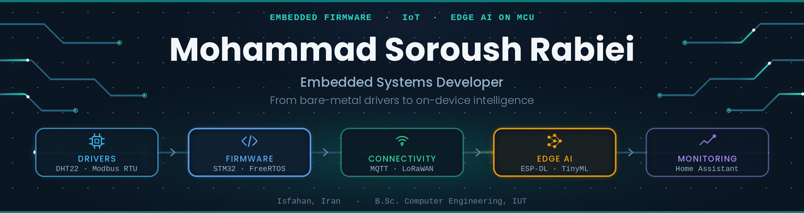
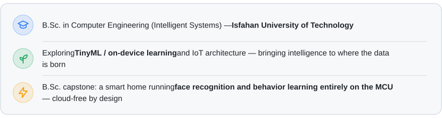
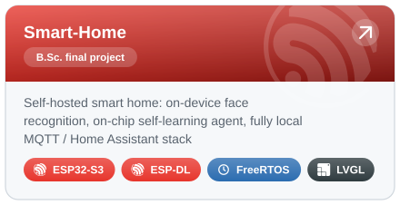
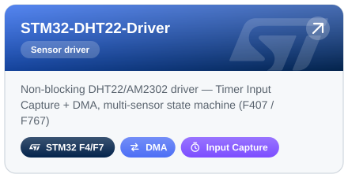
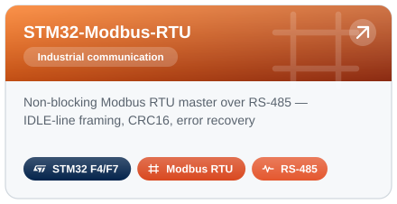
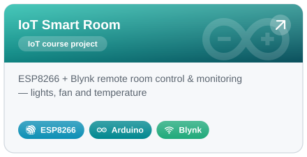

  

  <picture>
    <source media="(prefers-color-scheme: dark)" srcset="https://readme-typing-svg.demolab.com?font=JetBrains+Mono&weight=600&size=21&pause=1200&center=true&vCenter=true&width=560&color=2DD4BF&lines=STM32+%26+ESP32+Firmware;Edge+AI+on+Microcontrollers;IoT+%26+Cloud-Free+Systems;TinyML+Enthusiast" />
    
  </picture>

  <b>Embedded Systems Developer</b> 
  Firmware · IoT · Edge AI on microcontrollers

  

  &nbsp;
  &nbsp;
  &nbsp;
  

 

 

 

  
  
  
  

 

    

 

  <picture>
    <source media="(prefers-color-scheme: dark)" srcset="https://github-readme-stats.vercel.app/api?username=MohammadSoroushRabiei&show_icons=true&hide_border=true&include_all_commits=true&theme=tokyonight" />
    
  </picture>
  <picture>
    <source media="(prefers-color-scheme: dark)" srcset="https://streak-stats.demolab.com?user=MohammadSoroushRabiei&hide_border=true&theme=tokyonight" />
    
  </picture>
  <picture>
    <source media="(prefers-color-scheme: dark)" srcset="https://github-readme-stats.vercel.app/api/top-langs/?username=MohammadSoroushRabiei&layout=compact&hide_border=true&langs_count=6&theme=tokyonight" />
    
  </picture>

