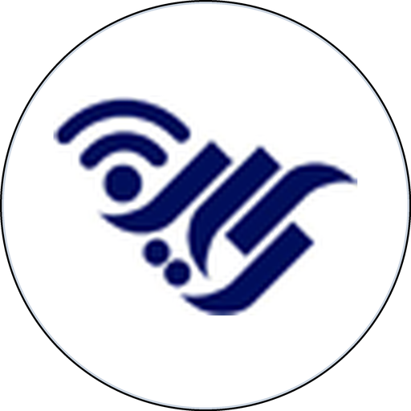
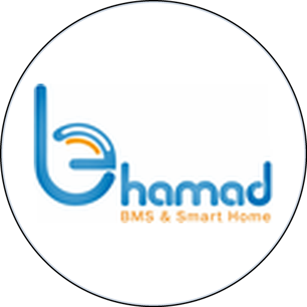

  

  <picture>
    <source media="(prefers-color-scheme: dark)" srcset="https://readme-typing-svg.demolab.com?font=JetBrains+Mono&weight=600&size=21&pause=1200&center=true&vCenter=true&width=560&color=2DD4BF&lines=STM32+%26+ESP32+Firmware;Edge+AI+on+Microcontrollers;IoT+%26+Cloud-Free+Systems;TinyML+Enthusiast" />
    
  </picture>

  <b>Embedded Systems Developer</b> · Isfahan, Iran 
  Firmware · IoT · Edge AI on microcontrollers

  

  &nbsp;
  &nbsp;
  &nbsp;
  

 

<h2 align="center">👨‍💻 About me</h2>

<table>
  <tr>
    <td valign="top" width="60%">
      <ul>
        <li>🎓 B.Sc. in Computer Engineering (Intelligent Systems) — <b>Isfahan University of Technology</b></li>
        <li>🌱 Exploring <b>TinyML / on-device learning</b> and IoT architecture — bringing intelligence to where the data is born</li>
        <li>⚡ B.Sc. capstone: a smart home running <b>face recognition and behavior learning entirely on the MCU</b> — cloud-free by design</li>
      </ul>
    </td>
    <td valign="top" width="40%">
      <b>At a glance</b>  
      📍 Isfahan, Iran 
      💼 Kian Pardaz Nagh-e Jahan 
      🗣️ Persian · English (B2) · Chinese (HSK 2)
    </td>
  </tr>
</table>

 

<h2 align="center">💼 Experience</h2>

<table>
  <tr>
    <td align="center" valign="top" width="110">
       
      Jul 2026 – Present
    </td>
    <td valign="top">
      <b>Embedded Systems Developer</b> — Kian Pardaz Nagh-e Jahan 
      Data-center infrastructure management (DCIM) product · Isfahan, Iran
      <ul>
        <li>Researched and selected temperature/humidity sensors for the product</li>
        <li>STM32 drivers: <a href="https://github.com/MohammadSoroushRabiei/STM32-DHT22-Driver">DHT22</a> (non-blocking state machine + Timer Input Capture + DMA) and a <a href="https://github.com/MohammadSoroushRabiei/STM32-Modbus-RTU">Modbus RTU master</a> over RS-485</li>
      </ul>
    </td>
  </tr>
  <tr>
    <td align="center" valign="top" width="110">
       
      Jun – Sep 2025
    </td>
    <td valign="top">
      <b>Embedded Systems Intern</b> — Behbood Ertebat Chehelsotoon Co. (Behamad) 
      Smart-city / municipal IoT · Isfahan, Iran
      <ul>
        <li>STM32 firmware for a smart-city device with LoRaWAN and a SIM800 GSM module</li>
        <li>MQTT on STM32 to connect a smart thermostat to the platform</li>
      </ul>
    </td>
  </tr>
</table>

 

<h2 align="center">🚀 Featured projects</h2>

<table>
  <tr>
    <td valign="top" width="50%">
      <h3><a href="https://github.com/MohammadSoroushRabiei/Smart-Home">🏠 Smart-Home</a></h3>
      B.Sc. final project  
      Self-hosted smart home: on-device face recognition, on-chip self-learning agent, fully local MQTT / Home Assistant stack  
      &nbsp;&nbsp;
    </td>
    <td valign="top" width="50%">
      <h3><a href="https://github.com/MohammadSoroushRabiei/STM32-DHT22-Driver">🌡️ STM32-DHT22-Driver</a></h3>
      Reusable sensor driver  
      Non-blocking DHT22/AM2302 driver — Timer Input Capture + DMA, multi-sensor state machine (F407 / F767)  
      &nbsp;
    </td>
  </tr>
  <tr>
    <td valign="top" width="50%">
      <h3><a href="https://github.com/MohammadSoroushRabiei/STM32-Modbus-RTU">🔌 STM32-Modbus-RTU</a></h3>
      Industrial communication  
      Non-blocking Modbus RTU master over RS-485 — IDLE-line framing, CRC16, error recovery  
      &nbsp;
    </td>
    <td valign="top" width="50%">
      <h3><a href="https://github.com/MohammadSoroushRabiei/IoT_SmartRoom_ESP8266">📡 IoT Smart Room</a></h3>
      IoT course project  
      ESP8266 + Blynk remote room control &amp; monitoring  
      &nbsp;
    </td>
  </tr>
</table>

 

<h2 align="center">🛠️ Tech Stack</h2>

    

<table>
  <tr>
    <td width="170"><b>Embedded &amp; RTOS</b></td>
    <td>&nbsp;&nbsp;&nbsp;&nbsp;&nbsp;</td>
  </tr>
  <tr>
    <td width="170"><b>Protocols &amp; data</b></td>
    <td>&nbsp;&nbsp;&nbsp;&nbsp;</td>
  </tr>
  <tr>
    <td width="170"><b>Toolchain &amp; debug</b></td>
    <td>&nbsp;&nbsp;&nbsp;&nbsp;&nbsp;&nbsp;</td>
  </tr>
  <tr>
    <td width="170"><b>AI &amp; vision</b></td>
    <td>&nbsp;&nbsp;</td>
  </tr>
</table>

 

<h2 align="center">📊 GitHub Stats</h2>

  <picture>
    <source media="(prefers-color-scheme: dark)" srcset="https://github-readme-stats.vercel.app/api?username=MohammadSoroushRabiei&show_icons=true&hide_border=true&include_all_commits=true&theme=tokyonight" />
    
  </picture>
  <picture>
    <source media="(prefers-color-scheme: dark)" srcset="https://streak-stats.demolab.com?user=MohammadSoroushRabiei&hide_border=true&theme=tokyonight" />
    
  </picture>
  <picture>
    <source media="(prefers-color-scheme: dark)" srcset="https://github-readme-stats.vercel.app/api/top-langs/?username=MohammadSoroushRabiei&layout=compact&hide_border=true&langs_count=6&theme=tokyonight" />
    
  </picture>

